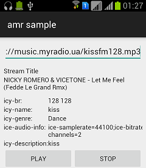
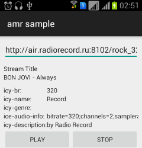

# audiostream-metadata-retriever

[](https://travis-ci.org/vsmaks/audiostream-metadata-retriever)
[ ](https://bintray.com/vsmaks/maven/amr/_latestVersion)
[](http://android-arsenal.com/details/1/1774)

This is an android-library which allow you to retrieve metadata such as title and headers of audiostream as soon as possible.

### Support protocols
 - Icecast
 - Shoutcast wil be added later

## How to use
```
//set uri of your favourite audiostream
Uri uri = Uri.parse("http://...");

//implement callbacks
OnNewMetadataListener listener = new OnNewMetadataListener()
{
    @Override
    public void onNewHeaders(String stringUri, List<String> name, List<String> desc,
      List<String> br, List<String> genre, List<String> info) {}
      
    @Override
    public void onNewStreamTitle(String stringUri, String streamTitle) {}
}

//Start parsing
AudiostreamMetadataManager.getInstance()
    .setUri(uri)
    .setOnNewMetadataListener(listener)
    .setUserAgent(UserAgent.WINDOWS_MEDIA_PLAYER)
    .start();
    
//Stop parsing
AudiostreamMetadataManager.getInstance().stop();
```




*See [sample](/app).*

### Support android APIs
- library: API 8+
- sample:  API 14+

---
## Gradle
```
dependencies {
    compile 'com.vodyasov:amr:0.5'
}
```
If jCenter is having issues (the library can't be resolved), add this to your app's build.gradle file:
```
repositories {
    maven {
        url  "http://dl.bintray.com/vsmaks/maven" 
    }
}
```

## Apps that uses this library
* [RS Music](https://play.google.com/store/apps/details?id=com.vodyasov.rsmusic)

## License

    Copyright 2015 Maksym Vodyasov

    Licensed under the Apache License, Version 2.0 (the "License");
    you may not use this file except in compliance with the License.
    You may obtain a copy of the License at

       http://www.apache.org/licenses/LICENSE-2.0

    Unless required by applicable law or agreed to in writing, software
    distributed under the License is distributed on an "AS IS" BASIS,
    WITHOUT WARRANTIES OR CONDITIONS OF ANY KIND, either express or implied.
    See the License for the specific language governing permissions and
    limitations under the License.
